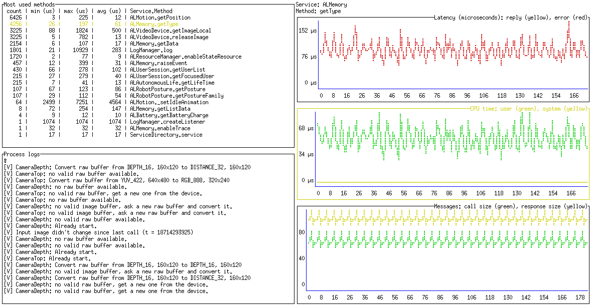

# QiTop

List the most used methods and display aggregated metrics.

## About

QiLoop is a observation tool designed to provide insights. It uses
method statistics APIs for the top list and event tracing APIs for the
line charts.

For events recording, consider `qicli trace` or `qiloop trace`.

## Navigation

    esc/q: quit
    j/k or up/down : naviate the top list
    enter: visualize the selected method
    space/backspace : scroll the logs
    page up/page down : navigate the logs

## Compilation for the robot

    env CGO_ENABLED=0 go build github.com/lugu/qitop

## Usage

    $ qitop -h
    Usage of qitop:
      -log-file string
            file where to write qitop logs
      -log-level int
            log level, 1:fatal, 2:error, 3:warning, 4:info, 5:verbose, 6:debug (default 4)
      -method string
            method name
      -qi-url string
            Service directory URL (default "tcp://localhost:9559")
      -service string
            service name
      -user string
            user name

## Credentials

One can create a file ~/.qiloop-auth.conf with the user and token.

## Credits

Build thanks to [Termdash](http://github.com/mum4k/termdash/wiki) and
[QiLoop](http://github.com/lugu/qiloop).
